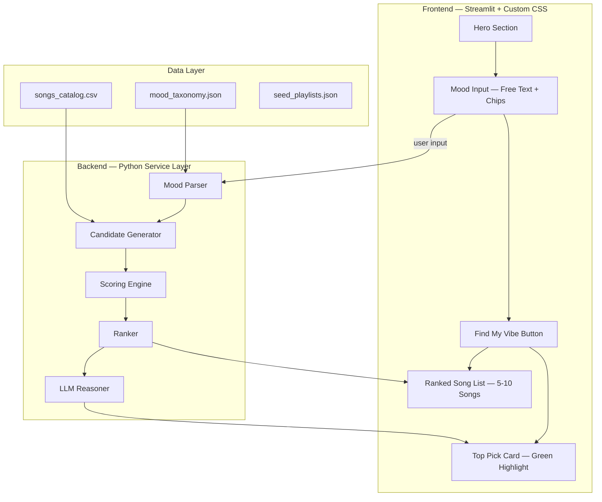
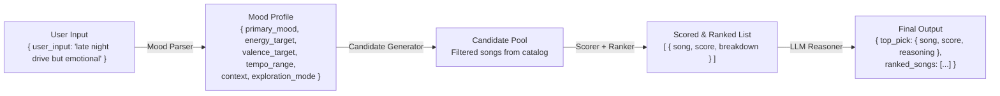
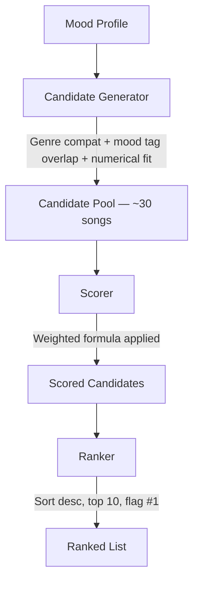
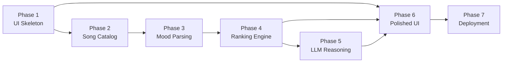

# Spotify Vibe — Phase-wise Architecture

> **Context**: Spotify's Growth Team aims to increase meaningful music discovery and reduce repetitive listening behavior. **Spotify Vibe** is an AI-native MVP that demonstrates a mood-driven discovery experience — asking users what vibe they're in, generating transparent ranked recommendations, and explaining why each pick fits.

---

## High-Level System Architecture



---

## Folder Structure

```text
spotify-vibe/
├── app.py                        # Streamlit entry point
├── requirements.txt
├── README.md
├── .env.example
├── .streamlit/
│   └── config.toml               # Dark theme config
├── assets/
│   ├── logo.png
│   └── styles.css                # Spotify-inspired custom CSS
├── data/
│   ├── songs_catalog.csv         # Curated 100+ song metadata
│   ├── mood_taxonomy.json        # Mood ↔ attribute mapping
│   └── seed_playlists.json       # Pre-built vibe playlists
├── src/
│   ├── config/
│   │   ├── settings.py           # Env vars, model config
│   │   └── prompts.py            # LLM prompt templates
│   ├── data/
│   │   ├── loader.py             # CSV/JSON ingestion
│   │   └── preprocess.py         # Tag normalization
│   ├── recommender/
│   │   ├── mood_parser.py        # Free-text → mood profile
│   │   ├── candidate_generator.py # Filter candidate pool
│   │   ├── scorer.py             # Weighted attribute scoring
│   │   ├── ranker.py             # Sort & flag top pick
│   │   └── reasoner.py           # LLM explanation generation
│   ├── ui/
│   │   ├── layout.py             # Sidebar + main layout
│   │   ├── home_page.py          # Hero + input section
│   │   ├── components.py         # Cards, pills, chips
│   │   └── theme.py              # Color palette constants
│   └── utils/
│       ├── logging.py
│       └── validators.py
└── tests/
    ├── test_mood_parser.py
    ├── test_ranker.py
    └── test_reasoner.py
```

---

## Recommendation Pipeline — Data Contracts



### Scoring Formula

```
final_score =
    0.30 × mood_tag_overlap     +
    0.20 × energy_similarity    +
    0.15 × valence_similarity   +
    0.10 × tempo_similarity     +
    0.10 × context_overlap      +
    0.10 × lyrics_theme_match   +
    0.05 × popularity_balance
```

> All values normalized to `0–1`. Scoring is **deterministic** — the LLM is used only for mood parsing and explanation generation, never as the sole recommender.

---

## Phase-wise Delivery Plan

---

### Phase 1 — Project Setup + UI Skeleton

| Attribute | Detail |
|-----------|--------|
| **Goal** | Stand up the repo, Streamlit shell, and a polished Spotify-inspired dark homepage |
| **Dependencies** | None (project kickoff) |

#### Deliverables
- Initialized repository with full folder structure
- Streamlit shell app (`app.py`)
- Dark Spotify-inspired layout via `assets/styles.css`
- Placeholder homepage with sidebar, header, and dummy cards

#### Animated Spotify Vibe Icon
The "Spotify Vibe" feature will sit on the main Spotify home screen as a prominent glowing icon (Gemini-style moving light). 
- When clicked, it expands into the full Vibe discovery experience (mood input, etc.).
- The app layout must be constrained to a mobile width (~414px max-width) to simulate a mobile app.
- Implementation: Use Streamlit session state to toggle between "Home" view and "Vibe" view. Style a Streamlit primary button with CSS to act as the animated glowing icon.

#### Agent Tasks
| # | Task | Module |
|---|------|--------|
| 1 | Create project directory structure | Root |
| 2 | Create theme CSS (dark background `#121212`, mobile constraint `.block-container { max-width: 414px; }`) | `assets/styles.css` |
| 3 | Build animated glowing icon by styling a Streamlit primary button | `assets/styles.css` |
| 4 | Implement state management for Home vs Vibe views | `src/ui/home_page.py` |
| 5 | Build dummy Spotify home screen (recently played, mixes) | `src/ui/home_page.py` |
| 6 | Verify mobile responsive layout renders correctly | Manual / Streamlit |

#### Color Palette Reference
| Token | Value |
|-------|-------|
| Page Background | `#121212` |
| Card Background | `#181818` |
| Card Hover | `#242424` |
| Text Primary | `#FFFFFF` |
| Text Secondary | `#B3B3B3` |
| Accent Green | `#1DB954` |
| Green Box BG | `rgba(29, 185, 84, 0.12)` |
| Green Box Border | `rgba(29, 185, 84, 0.35)` |

#### Exit Criteria
> ✅ App opens with a polished Spotify-inspired dark homepage — no functionality yet, but visually demoable.

---

### Phase 2 — Song Catalog + Data Loader

| Attribute | Detail |
|-----------|--------|
| **Goal** | Create the curated song catalog and build the data ingestion layer |
| **Dependencies** | Phase 1 (project structure exists) |

#### Deliverables
- Curated song catalog CSV with **100+ songs**
- Loader module for CSV/JSON ingestion
- Metadata validation and tag preprocessing

#### Song Catalog Schema
```csv
song_id, title, artist, genre, energy, valence, danceability, tempo, mood_tags, context_tags, lyrics_theme, popularity
1, Sunset Drive, Artist A, indie-pop, 0.42, 0.71, 0.58, 96, "chill|warm|sunset", "evening|solo", "hopeful", 78
```

#### Agent Tasks
| # | Task | Module |
|---|------|--------|
| 1 | Create sample catalog with ≥100 songs covering diverse moods/genres | `data/songs_catalog.csv` |
| 2 | Add all required metadata fields (energy, valence, danceability, tempo, mood_tags, context_tags, lyrics_theme, popularity) | `data/songs_catalog.csv` |
| 3 | Implement CSV/JSON loader | `src/data/loader.py` |
| 4 | Preprocess tag fields (split pipe-delimited tags, normalize casing) | `src/data/preprocess.py` |
| 5 | Add unit tests for loader and preprocessor | `tests/` |

#### Exit Criteria
> ✅ Song catalog loads cleanly into a DataFrame / object model with validated, preprocessed metadata.

---

### Phase 3 — Mood Input Parsing

| Attribute | Detail |
|-----------|--------|
| **Goal** | Convert free-text user mood input into a structured mood profile |
| **Dependencies** | Phase 2 (catalog loaded for mood taxonomy alignment) |

#### Deliverables
- Free-text mood parser (LLM-powered when API key available)
- Fallback rule-based parser (keyword → attribute mapping)
- Structured mood profile output conforming to schema

#### Mood Profile Schema
```json
{
  "primary_mood": "calm",
  "secondary_mood": "hopeful",
  "energy_target": 0.35,
  "valence_target": 0.62,
  "tempo_range": [80, 105],
  "context": ["night", "solo"],
  "exploration_mode": "safe"
}
```

#### LLM Prompt (Mood Parsing)
```python
MOOD_PARSE_PROMPT = """
You are a music mood parser.
Convert the user's mood/vibe input into structured JSON.

Return valid JSON with:
- primary_mood
- secondary_mood
- energy_target (0 to 1)
- valence_target (0 to 1)
- tempo_range ([min, max])
- context (array)
- exploration_mode (safe, balanced, adventurous)

User input:
{user_input}
"""
```

#### Agent Tasks
| # | Task | Module |
|---|------|--------|
| 1 | Implement rule-based parser (keyword mapping for common moods) | `src/recommender/mood_parser.py` |
| 2 | Implement LLM-based parser (uses `MOOD_PARSE_PROMPT`) | `src/recommender/mood_parser.py` |
| 3 | Normalize output to mood profile schema (Pydantic model) | `src/recommender/mood_parser.py` |
| 4 | Add mood presets for quick-select chip buttons (Chill, Focus, Workout, Heartbreak, Rainy Evening, Late Night Drive, Happy Chaos) | `src/ui/components.py` |
| 5 | Add unit tests for both parsers | `tests/test_mood_parser.py` |

#### Exit Criteria
> ✅ User input (free text or chip) reliably maps to a structured mood profile. Works with or without LLM API key.

---

### Phase 4 — Ranking Engine

| Attribute | Detail |
|-----------|--------|
| **Goal** | Build the deterministic candidate generation, scoring, and ranking pipeline |
| **Dependencies** | Phase 2 (catalog), Phase 3 (mood profile) |

#### Deliverables
- Candidate generation (filter by genre, mood tags, broad numerical fit)
- Weighted scoring function
- Ranked results list with score breakdown

#### Architecture Flow


#### Agent Tasks
| # | Task | Module |
|---|------|--------|
| 1 | Implement candidate filter (genre compatibility, mood tag overlap, broad energy/valence/tempo fit, diversity rule) | `src/recommender/candidate_generator.py` |
| 2 | Implement weighted scoring formula (7 components) | `src/recommender/scorer.py` |
| 3 | Rank candidates by `final_score` descending, return top 10, flag rank 1 | `src/recommender/ranker.py` |
| 4 | Expose score breakdown per song | `src/recommender/scorer.py` |
| 5 | Test ranking consistency across multiple moods | `tests/test_ranker.py` |

#### Ranking Rules
- Rank candidates by `final_score` descending
- Return top 10
- Mark rank 1 as **top pick**
- If scores are too close, optionally ask LLM to break tie using metadata summary

#### Exit Criteria
> ✅ Given a mood profile, the engine returns a deterministic ranked list of recommended songs with transparent scores.

---

### Phase 5 — LLM Reasoning Layer

| Attribute | Detail |
|-----------|--------|
| **Goal** | Generate a human-readable explanation for why the top song is the best match |
| **Dependencies** | Phase 4 (ranked results with top pick) |

#### Deliverables
- LLM-powered explanation for top song
- Fallback template-based reasoning when LLM is unavailable

#### LLM Prompt (Reasoning)
```python
TOP_PICK_REASON_PROMPT = """
You are explaining a music recommendation inside an AI-powered music app.

Given:
- user's mood profile
- the top recommended song metadata
- the next 2 alternatives

Write a concise explanation (2-4 sentences) for why the top song
is the best fit right now.
The explanation must:
- mention mood fit
- mention musical qualities
- sound personal but not overly emotional
- avoid making up unknown facts

User mood:
{mood_profile}

Top song:
{top_song}

Other candidates:
{other_candidates}
"""
```

#### Agent Tasks
| # | Task | Module |
|---|------|--------|
| 1 | Implement LLM reasoner using `TOP_PICK_REASON_PROMPT` | `src/recommender/reasoner.py` |
| 2 | Generate concise 2-4 sentence explanation | `src/recommender/reasoner.py` |
| 3 | Ensure reasoning only uses known metadata (no hallucinated facts) | `src/config/prompts.py` |
| 4 | Implement fallback deterministic template reasoning | `src/recommender/reasoner.py` |
| 5 | Add tests for both reasoning paths | `tests/test_reasoner.py` |

#### Exit Criteria
> ✅ Top choice displays a believable, useful explanation that references actual mood fit and musical qualities. App remains fully functional without an LLM API key.

---

### Phase 6 — Polished Recommendation UI

| Attribute | Detail |
|-----------|--------|
| **Goal** | Wire the full pipeline to the frontend with a polished, consumer-grade UI |
| **Dependencies** | Phase 1 (UI shell), Phase 4 (ranked results), Phase 5 (reasoning) |

#### Deliverables
- Subtle green top pick card (highlight box)
- Styled recommendation cards for ranked list
- Interaction polish (spacing, typography, hierarchy, hover states)

#### Top Pick Card CSS Spec
```css
/* Top Pick — highlighted card */
.top-pick {
    background: rgba(29, 185, 84, 0.10);
    border: 1px solid rgba(29, 185, 84, 0.35);
    border-radius: 16px;
    padding: 20px;
    box-shadow: none;
}

/* General ranked song card */
.song-card {
    background: #181818;
    border-radius: 14px;
    padding: 16px;
}
```

#### UI Layout Spec
| Section | Contents |
|---------|----------|
| **Hero** | App logo, title "Spotify Vibe", subtitle "Tell us the vibe. We'll find the soundtrack." |
| **Mood Input** | Free-text input + quick chips (Chill, Focus, Workout, Heartbreak, Rainy Evening, Late Night Drive, Happy Chaos) |
| **Top Pick** | Green bordered box · song title + artist · confidence/match score · explanation paragraph · "Best match right now" label |
| **Ranked Songs** | Vertical list of compact cards · rank number · title · artist · small match score · 1-line fit summary |
| **Footer** | Optional "Try another vibe" button |

#### Agent Tasks
| # | Task | Module |
|---|------|--------|
| 1 | Build highlighted top pick component with green box styling | `src/ui/components.py` |
| 2 | Style ranked list cards (rank, title, artist, score pill, 1-line summary) | `src/ui/components.py` |
| 3 | Add score pills / match indicators | `src/ui/components.py` |
| 4 | Improve spacing, typography, and visual hierarchy | `assets/styles.css` |
| 5 | End-to-end wiring: input → mood parser → ranker → reasoner → UI render | `app.py` |

#### Exit Criteria
> ✅ App feels like a demoable consumer feature, not a utility dashboard. Full pipeline works end to end.

---

### Phase 7 — Deployment

| Attribute | Detail |
|-----------|--------|
| **Goal** | Deploy the app publicly with a shareable link |
| **Dependencies** | Phase 6 (fully functional app) |

#### Deliverables
- Public app link (Streamlit Community Cloud)
- Secrets configured (LLM API keys)
- Final `README.md` with setup and usage instructions

#### Deployment Target
| Platform | Details |
|----------|---------|
| **Streamlit Community Cloud** | GitHub-connected deployment, auto-updates from repo |

#### Agent Tasks
| # | Task | Module |
|---|------|--------|
| 1 | Prepare final `requirements.txt` | Root |
| 2 | Configure Streamlit secrets (`.streamlit/secrets.toml`) | `.streamlit/` |
| 3 | Push repo to GitHub | Git |
| 4 | Connect repo in Streamlit Community Cloud, set `app.py` as main file | Cloud UI |
| 5 | Verify dark theme and CSS load correctly on deployed URL | Manual |
| 6 | Verify public link works end to end | Manual |

#### Requirements
```text
streamlit
pandas
numpy
plotly
python-dotenv
pydantic
scikit-learn
# Optional LLM clients:
openai
anthropic
```

#### Environment Variables
```text
OPENAI_API_KEY=
ANTHROPIC_API_KEY=
LLM_PROVIDER=openai
```
> If no key is available: rule-based parsing + template explanation mode.

#### Exit Criteria
> ✅ Public URL works end to end. Anyone with the link can enter a mood and see ranked, explained recommendations.

---

## MVP Acceptance Criteria

Spotify Vibe is **complete** when all of the following are true:

- [ ] User can enter a mood/vibe (free text or chip)
- [ ] System returns ranked song recommendations (5–10 songs)
- [ ] Top song is highlighted in a subtle green box
- [ ] Top song includes an explanation for why it is the best fit
- [ ] Page visually resembles a Spotify-inspired dark UI
- [ ] App is publicly accessible via a shareable link

---

## Non-Goals

> **Do NOT implement** any of the following:
> - Real Spotify authentication
> - Playback controls
> - Actual Spotify personalization
> - Production-grade recommendation systems
> - Copyrighted streaming features
>
> This is a **discovery-focused AI-native prototype**.

---

## Phase Dependency Graph



---

*Document generated from the Spotify Vibe MVP implementation spec and the Spotify Growth Team problem statement.*
